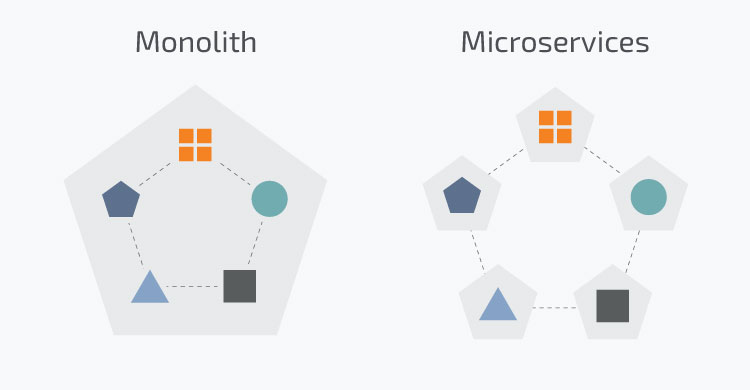
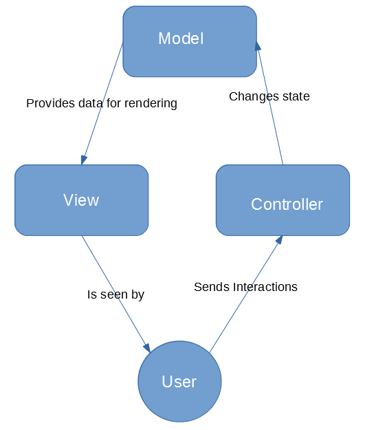

# Node Architecture

---

# *The code is the truth … but it’s not the entire truth.*

---

# *All models are wrong ...*

# *But some of them are useful.*

---

## What is architecture ? 

Bob Martin would say:

> *The art of separation, grouping, abstraction, and hiding.*

Software architecture is, fundamentally, a composition of architectural design decisions.

---

## When to commit ?
 
What if your company has made a commitment to a certain database, or a certain web server, or a certain framework? 

A good architect pretends that the decision has not been made, and shapes the system such that those decisions can still be deferred or changed for as long as possible.

**A good architect maximizes the number of decisions not made.**

---

## What drives architecture ? 

The fulcrum of design decisions is change.

Separate those things that change for different reasons, group together those things that change for the same reason.

---

## Patterns

These design decisions should be represented as first-class entities in the software architecture and it should, at least before system deployment, be possible to add, remove and change architectural design decisions with limited effort.

---

## This presentation

This presentation will showcase only at the most surface level tried and tested architectural patterns which speak to universal problems that each project will face:

- How much separation should the architecture impose?
- How to organize the project internally ?
- How should the architecture organize the internal communication ?
- How to present the capabilities of the project to the outside world ?

---

## United or Separate ? Monolith vs Micro-services



---

## What is a Monolith approach ?

Monolithic software is designed to be self-contained; components of the program are interconnected and interdependent rather than loosely coupled as is the case with modular software programs. In a tightly-coupled architecture, each component and its associated components must be present in order for code to be executed or compiled.

This is the traditional approach to how to architecture your project in terms of how split it should be, and is the default stance for most projects.

---

## Advantages

- easier re-use of code (no inter-application boundaries)

- less overhead 

- coding standards, DoD, procedures are easier to reuse

- higher cohesion in the projects code

---

## Disadvantages

- less freedom for the individual developer

- larger ramp-up needed

- higher coupling of the project's code

---

## What is the Micro-services approach ?

Martin Fowler would say:

> In short, the microservice architectural style is an approach to developing a single application as a suite of small services, each running in its own process and communicating with lightweight mechanisms, often an HTTP resource API.

---

## Advantages

- immense flexibility for the developer to tackle problems in their own way

- project as a whole is safe guarded from one module failing

- greater feeling of ownership of the code thereby higher morale

---

## Disadvantages

- more overhead

- latency

- harder to communicate/coordinate with teams who own other micros-services

- requires more experienced than average developers to be effective

---

## Final Answer ?

# Monolith

---

## Why ?

Due to the most probable size and make-up of the teams that will work on Node projects.

It’s wide use in the Node community as well as other communities we can take inspiration from means that we can
adopt these exterior lessons faster.

It will be easier to communicate, learn and develop good lessons from the first projects, due to the common frame of refference that the monolith will provide.

We must remember that monolith vs micro-services is a range and not a binary choice that locks us in.

---

## How to organize your code ?

These are the patterns most people associate with architecture as they have a large impact on how we structure our
projects:

# MVC vs N-Layer vs Clean Architecture

---

## MVC

Is an architectural pattern which demands we separate our code into 3 large sections each with their own responsibilities:

Model: This section deals with the models and business data. 

View: This section deals with how we display our data to the exterior.

Controllers: This section deals with the logic of your application.

---



---
## MVC

It should be noted that MVC is a very common architectural pattern and can be applied at several levels and even recursively in the application.

You can have your entire application implement the MVC pattern and then within the View layer of the application again  apply MVC to all the components within.

MVC is also very popular in UI solutions, a good example would be Angular which mandates strict adherence to MVC for it's components.

---

## Model

All code that deals with the data of the application, storing it, modeling it, converting it etc conceptually belong to the Model.

Examples: services, ORM, ODM, DTO, transformers, business models, local storage

---

## Controller

All code that deals with user actions and how they effect the state of the application conceptually resides in the Controller category.

Examples: controllers middleware in Express, business logic  

---

## View

All code which has the purpose of communicating with the exterior and with the client conceptually falls in the View category.

Views can are not strictly speaking just UI's (html, FE applications) they also include REST endpoints, GraphQL, SOAP, etc.

Examples: Express routes,REST, GraphQL, rendered html views, SPA applications

---

## N-Layer

N-Layer is an architectural pattern in which an application is made up out of several layers stacked upon each other, each with it's own distinct and well defined purpose with a layer only being able to communicate and know about it's direct neighbors.

As it is a general pattern there is little restrictions on what can be a layer and it is very easy to apply to whatever specific needs an application has as well as scale vertically by adding removing layers as needed.

---

## N-Layer

It is often confused with another architectural pattern N-Tier which deals with composing different applications which reside on different servers into one common project.

Common layers which can be found in most applications are View Layer, Controller Layer and Model Layer thereby creating confusion on what is MVC and what is N-Layer architecture.

A key difference is that communication in MVC is triangular as described in the previous sections while in N-Layer it is strictly linear.

---

## N-Layer

You won't often see N-Layer implemented as anything less that 3 layers, the previously mentioned view, controller and models.

Yet the organization of MVC does not need to be moved directly into the N-Layer, what in MVC is a single Model layer might be better implemented as multiple layers some dealing with DB access others with mapping to DTO or view-models.

---

## N-Layer

A key aspect of N-Layer is that each layer knows only about it's direct neighbors in the stack of layers.

Let's assume Layer X deals with transforming from raw data into models which are used elsewhere in the application.

It knows a lot about the Layer beneath it X+1 as it needs to call X+1's methods.

It knows about the layer above it X-1 but much less, only the interface of the models it needs to send up.

---

## N-Layer

This is very advantageous as we can insert or remove layers outside of the X-1 and X+1 ranges and layer X should in theory be unaffected.

Example: We could add caching bellow X or add another type of endpoints above it.

---

## N-Layer

Examples of what might be inside the layers: SPA, views, routers, ORM, ODM, caching, logging, validation, sanitation, event ques, business models, domain logic, email generation, integrations with 3rd parties, marketing etc.

---

## Clean Architecture

Is an architectural pattern developed by Bob Martin, it mandates that the application be built up in layers at the most central layer that all of the other depend upon there should be the most stable, business critical entities.

---


---

## Clean Architecture

Entities should be very simple (preferably POJO or DTO) and correspond one to one to RL business.

Example: A hotel project will have an entity representing an hotel room.

Entities are involved in the next layer, Use-Cases which are more prone to change but still very stable.

---

## Clean Architecture

The next layers up are more technical being controllers, gateways, API etc.

They are even more prone to change and deal more with the implementation than with the business model.

---

## Clean Architecture

The very final layer in the application deals with communicating with the human user or other APIs.

Here change happens often and is inevitable but if we followed the architecture correctly the solid core of the application should be untouched.

---

## Final Answer

# N-Layer

---

## Why ?

Without knowing the specifics of each project (scope, requirements, domain knowledge, experience and size of team) N-Layer provides the least restrictions while still providing guidance.

It also allows the most freedom to absorb lessons from the other patterns while mapping very easily to the capabilities of Node and Express.

---

## Why ?

There is no universal answer, outliers from our expectations will certainly come along.

There will certainly be cases where the smaller size and experience of the team will mesh better with the MVC architecture.

Or the size and lifespan of the project will make Clean Architecture not only attractive but the only realistic option.

---

## Why ?

It is my opinion that N-Layer is the best positioned to absorb the lessons from both Clean Architecture (entities, solid core) and MVC (clear separation and strong identities to each component) and thus should be our starting point in terms of structure.

It is simply the most versatile "weapon" at our disposal.

---

## Communication

There a few well developed architecture patterns which can be used to describe how our modules will communicate within the project:

- pipes and filters

- event driven

- pub/sub

--- 

## Pipes and Filters

An architectural style in which modules where the output of an module is piped into another module as it’s input and that module’s output is piped into another etc.

Modules thus make up flows of data from one end of the application to the other with each module having one well defined function and well defined inputs and outputs.

**Advantages**: less overhead, explicit flows, linear debugging, synergy with FP and OOP

**Disadvantages**: higher coupling, more setup

---

## Pipes and Filters

```
const validateId = (formData: any): string {
// implementation
}

const getUserAPI = (id: string): any {
// implementation
}

const userTransformer = (raw: any): IUser {
// implementation
}

const getUserService = (formData: any): IUser {
  let id: string = validateId(formData);
  let rawUser: any = getUserAPI(id);
  return userTransformer(rawUser);
}

// In the business logic

let user: IUser = getUserService(form);

```

---

## Event Driven

The Event Driven paradigm is an architecture where the components of a system communicate entirely through the emitting, detection and consumption of events.

Event in this case can be seen as a significant change in the state of the system.

It allows loose coupling and high reactivity thereby it's most appropriate for complex systems and especially UI's.

---

## Event Driven

```
const events = new EventEmitter();
events.on('foo', () => { console.log('foo'); });
events.emit('foo'); // Prints "foo"
events.off('foo');
events.emit('foo'); // Nothing will happen

```

**Advantages**: lower coupling, multiple emitters/consumers

**Disadvantages**: need to encapsulate, harder debugging

Examples: DOM events, Angular Emitters/Subscribers

---

## Pub/Sub

An architecture pattern which describes communication via messages, where a publisher pushes messages into a channel, multiple subscribers listen on the various channels and react to the messages.

This allows for a loose coupling between the publishers and subscribers while at the same time permitting communication in the system and organized flows of data.

---

## Pub/Sub

```
events.publish('/page/load', {
	url: '/some/url/path' // any argument
});

var subscription = events.subscribe('/page/load', function(obj) {
	// Do something now that the event has occurred
});

// ...sometime later where I no longer want subscription...
subscription.remove();
```

**Advantages**: loose coupling, scallable, low latency 
**Disadvantages**: overhead, order of events, fit for large projects

---

## Final Answer ?

# Pipes

---
## Why ?

For simpler project where the number of modules that need to communicate are smaller, pipes are sufficient and they require less overhead and infrastructure.

The fact that with pipes as opposed to event-based or pub/sub architecture the flows of data are very explicit and the links easy to debug in the code.

For larger projects or those that need to be more distributed events or pub/sub are certainly worth investigating.

---

## API Architecture

What sort of API do we present to the exterior ?

# REST vs GraphQL

---
## REST

Representational state transfer (REST) is a software architectural style that defines a set of constraints to be used for creating APIs.

Six guiding constraints define a RESTful system:

- client-server architecture

- statelessness

- cacheability

- layered system

- code on demand (optional)

- uniform interface (resources +HTTP)

---

## REST

REST uses the standard CRUD HTTP Verbs (GET, POST, PUT, DELETE) and leverages HTTP conventions and centered around data resources (HTTP URIs) rather than attempting to fight HTTP. 

**Advantages**: de-facto standard, easy to implement, cacheable

**Disadvantages**: end points need to be explicitly defined, multiple calls may be needed

---

## REST

```
router.get('/new', galaxyController.newGalaxy);
router.post('/new', galaxyController.createGalaxy);

router.get('/all', galaxyController.listAllGalaxies);
router.get('/:name', galaxyController.displayGalaxy);

app.use('/galaxy', galaxyRouter);
```

---
## GraphQL

GraphQL is an data query and manipulation language for APIs, and a runtime for fulfilling queries with existing data.

As it is a significant challenger to the REST architecture I will treat it for this presentation as it's own architecture pattern because employing it into a project will necessitate changes in the structure of the code. 

GraphQL supports reading, writing (mutating), and subscribing to changes to data.

---

## GraphQL

The major difference between GrapQL and REST is that while with REST the BE developer has to handle everything from the structure of the model to how it is served to the FE, GraphQL allows the BE to declare the structure of the data and then the FE can create with the QL any combination of data they need.

Thereby eliminating the major disadvantage of requiring multiple calls in REST and storing the data in the FE state.


**Advantages**: flexible, less coupling between BE and FE

**Disadvantages**: not cacheable, separate QL, additional libraries needed 

---

## GraphQL

```
app.use('/graphql', graphqlHttp({
  schema: buildSchema(`
    type Task {
      id: ID!
      title: String!
      description: String!  ${/* ! === not null */''}
    }

    input TaskInput {
      title: String!
      description: String!
    }

    type RootQuery {  ${/* entry point for fetching data */''}
      tasks: [Task!]!
        ${/* returns a list (Array) of Task data types */''}
        ${/* cannot return 'null' and cannot return an Array with 'null' */''}
        ${/* add as many endpoints to this object as needed */''}
    }

    type RootMutation {  ${/* entry point for manipulating data */''}
      createTask(taskInput: TaskInput!): Task!
        ${/* custom param 'taskInput' takes a TaskInput data type */ ''}
        ${/* returns a Task data type */''}
        ${/* add as many operations to this object as needed */''}
    }

    schema {
      query: RootQuery  ${/* points to query entry point */''}
      mutation: RootMutation  ${/* points to mutation entry point */''}
    }
  `),
```

---

## GraphQL

```
  rootValue: {
    tasks: () => {
      return Tasks.findAll()  // query the database
      .then(allTasks => allTasks)  // return all tasks as defined in our RootQuery
      .catch(err => {
        console.log(err)
        throw err
      })
    },
    createTask: args => {  // 'args' is an object of all listed parameters
      const { title, description } = args.taskInput  // destructuring assignment

      const newTask = {  // assign TaskInput properties to a new task object
        title,
        description
      }

      return Tasks.create(newTask)  // query database to create the new task
      .then(createdTask => createdTask)  // return new task as defined in our RootMutation
      .catch(err => {
        console.log(err)
        throw err
      })
    }
  },
  graphiql: true // turn on UI
}))
```

---

## Final Answer 

The choice here is much harder as they're both very useful patterns to use and even more so than in other cases it's hard to judge which is a better fit to a project without knowing the exact requirements and going on a case by case basis.

---

## Why ?

I would go with REST if the business logic of the project is very well defined and not that prone to change, this would negate REST's disadvantage that adding new endpoints is laborious.

Same if the project was small and the number of resources/endpoints is fixed and most needs of the FE can be achieved by singular calls to an endpoint.

---

## Why ?

I would chose GraphQL if the project dealt with more complex models and for the one need of the UI multiple calls to endpoints were required.

The fact that less endpoints are needed would recommend GraphQL to projects that will scale a lot accumulating many use cases or where the business logic will change.

An ideal scenario would be starting a new project with GraphQL and allowing both the BE and FE developers to learn. 

---

## Final thoughts

If we compose all of these patterns we will get an flexible template from which to start new applications:

- **monolith** application where the code is divided in

- **n-layers** which communicate both internally and externally with

- **pipes and filters** which ultimately lead to 

- an **REST** API which serves as our gateway 

Keep in mind that as we grow and encounter different requirements more will be naturally added.


I'll leave you with one final quote:

---

# The best house is the one you build with your own hands.

---

# Thank you for your time, questions ?

---

# Bibliography

- [Pub/Sub in JS](https://davidwalsh.name/pubsub-javascript) 
- [Enterprise Integration Patterns](https://www.enterpriseintegrationpatterns.com/)
- [Clean Arhitecture](https://blog.cleancoder.com/uncle-bob/2012/08/13/the-clean-architecture.html)
- Frank Buschmann, ‎Kevlin Henney, ‎Douglas C. Schmidt (2007) Pattern-Oriented Software Architecture, On Patterns and Pattern Languages
- [Monolith and Microservices](https://microservices.io/patterns/monolithic.html)
- [Monoltih vs Microservices](https://www.n-ix.com/microservices-vs-monolith-which-architecture-best-choice-your-business/)